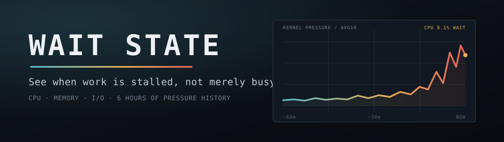
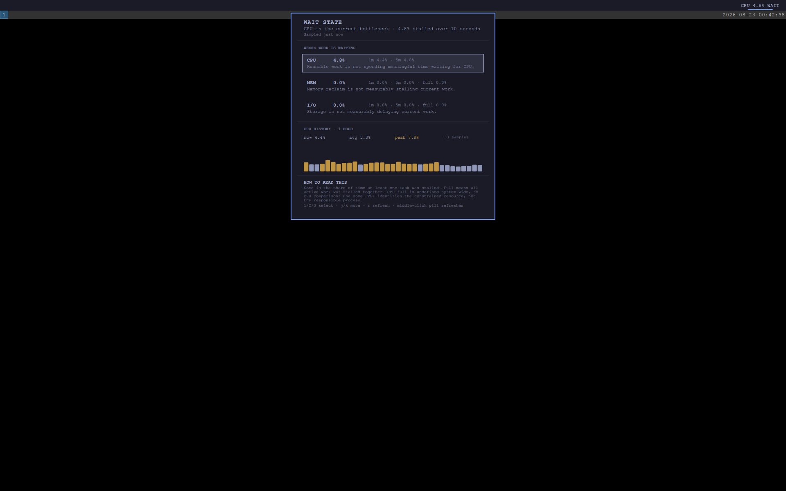

<p align="center"></p>

# Wait State

CPU usage tells you the machine is busy. Wait State tells you whether your work
is stuck.

Wait State is a native Omarchy bar widget for Linux pressure stall information
(PSI). It reads the kernel's CPU, memory, and I/O pressure signals, follows the
worst current bottleneck in the bar, and keeps six hours of bounded history for
the panel.



## What it answers

Traditional monitors report utilization: how much CPU or memory is in use. A
busy machine may still be responsive. PSI reports the share of wall-clock time
that work could not proceed because it was waiting for a resource.

The bar reads like this:

```text
CPU 8.1% WAIT
```

Click it to see:

- live 10-second pressure for CPU, memory, and I/O;
- 1-minute and 5-minute kernel averages;
- partial stalls (`some`) and whole-machine stalls (`full`);
- a bounded 15-minute, 1-hour, or 6-hour history;
- current, average, and peak pressure for the selected resource;
- a plain-language interpretation that does not pretend to identify a process.

CPU `full` is undefined at the system level, so Wait State deliberately uses
`some` for CPU comparisons. Memory and I/O rows also expose `full`, where it
means every non-idle task was stalled together.

## Install

```bash
omarchy plugin add https://github.com/jeremylongshore/omarchy-wait-state-entry.git --enable --yes
```

Wait State requires an Omarchy kernel with PSI enabled. Current Omarchy systems
expose these read-only files:

```text
/proc/pressure/cpu
/proc/pressure/memory
/proc/pressure/io
```

If a source is missing, the panel says it is unavailable. A partial read never
masquerades as a complete measurement.

## Controls

| Input | Action |
| --- | --- |
| Click the pill | Open or close the panel |
| Middle-click the pill | Refresh immediately |
| Click a resource row | Select its history |
| `j` / `k` | Move through CPU, memory, and I/O |
| `1` / `2` / `3` | Select CPU, memory, or I/O |
| `r` | Refresh immediately |
| `Esc` | Close the panel |

## Settings

| Setting | Default | Purpose |
| --- | --- | --- |
| Refresh interval | 5 seconds | Live sampling cadence: 2, 5, 10, or 30 seconds |
| Bar resource | Worst | Follow the highest current pressure or pin one resource |
| Default history | 1 hour | Start the panel at 15 minutes, 1 hour, or 6 hours |
| Warning threshold | 5% | Elevated-state display boundary |
| Critical threshold | 20% | Severe-state display boundary |

The thresholds are presentation choices, not universal kernel limits. Workload
and latency objectives differ, so the plugin normalizes invalid settings but
does not claim that one percentage is harmful on every machine.

## Data and resource bounds

Wait State has no network access, credentials, telemetry, or elevated actions.
It does not kill processes or change system configuration.

- Exactly three fixed procfs files are read.
- Each file is capped at 512 bytes by the reader.
- The combined parser input is capped again at 4,096 characters.
- History is sampled at most once every 15 seconds.
- Persistence is capped at 1,440 points, which is six hours at that cadence.
- The state parser refuses files above 1,000,000 characters.
- State lives at `$XDG_STATE_HOME/omarchy/wait-state/state.json`, falling back
  to `~/.local/state/omarchy/wait-state/state.json`.

The runtime is QML plus Bash and coreutils. Node is used only by the offline
test suite and is never invoked by the graphical session.

## What PSI can and cannot prove

PSI can identify whether CPU, memory, or I/O is constraining forward progress.
It cannot name the process responsible. The panel suggests the next class of
investigation, but it never turns a resource-level signal into a process-level
accusation.

Kernel documentation:
[Pressure Stall Information](https://docs.kernel.org/accounting/psi.html).

## Development and verification

```bash
npm test
bash scripts/run-plugin-gates.sh .
bash scripts/rig-verify.sh .
bash scripts/rig-render.sh . /tmp/wait-state.png
```

Static validation and `qmllint` do not prove the plugin loads. The render step
starts a real headless Omarchy shell, opens the panel, captures it, and treats
every plugin-sourced QML warning as a finding.

## Remove

```bash
omarchy plugin remove io.github.jeremylongshore.wait-state --yes
rm -rf -- "${XDG_STATE_HOME:-$HOME/.local/state}/omarchy/wait-state"
```

The second command is optional and deletes only Wait State's disposable local
history.

## License

MIT.
